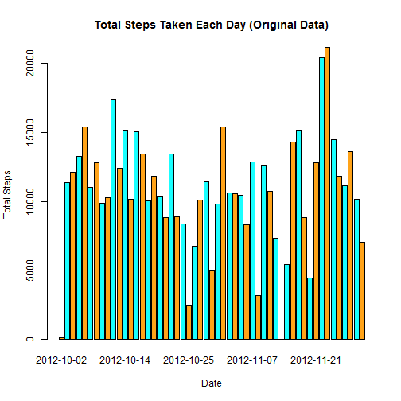
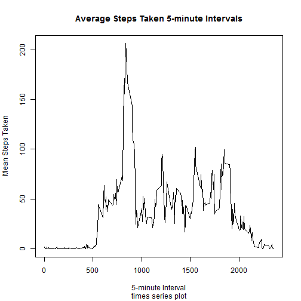
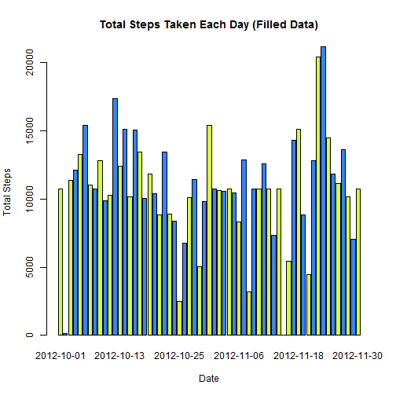

Reproducible Research: Peer Assessment 1
==================================================

*Notice: Before processing this R markdown file with the knit2html() function in R (from the knitr package), you should specify the encoding as "UTF-8":
knit2html(input = "PA1_template.Rmd", encoding = "UTF-8")*

## Set global options and unzip datafile

```r
library(knitr)
opts_chunk$set(echo = TRUE)
if(!file.exists("activity.csv")){unzip("activity.zip")}
```

## Loading and preprocessing the data
1.  Load the data (i.e. read.csv())

```r
activity <- read.csv("activity.csv")
```
2.  Process/transform the data (if necessary) into a format suitable for your analysis

Just to view the data here:


```r
names(activity) 
```

```
## [1] "steps"    "date"     "interval"
```

```r
head(activity) 
```

```
##   steps       date interval
## 1    NA 2012-10-01        0
## 2    NA 2012-10-01        5
## 3    NA 2012-10-01       10
## 4    NA 2012-10-01       15
## 5    NA 2012-10-01       20
## 6    NA 2012-10-01       25
```

```r
dim(activity)
```

```
## [1] 17568     3
```

```r
sum(is.na(activity))
```

```
## [1] 2304
```

```r
summary(activity)
```

```
##      steps                date          interval     
##  Min.   :  0.00   2012-10-01:  288   Min.   :   0.0  
##  1st Qu.:  0.00   2012-10-02:  288   1st Qu.: 588.8  
##  Median :  0.00   2012-10-03:  288   Median :1177.5  
##  Mean   : 37.38   2012-10-04:  288   Mean   :1177.5  
##  3rd Qu.: 12.00   2012-10-05:  288   3rd Qu.:1766.2  
##  Max.   :806.00   2012-10-06:  288   Max.   :2355.0  
##  NA's   :2304     (Other)   :15840
```


## What is mean total number of steps taken per day?
For this part of the assignment, ignore the missing values in the dataset.

1.  Make a histogram of the total number of steps taken each day

*(Note: histogram should be barplot here)*


```r
steps.date <- aggregate(steps ~ date, data = activity, FUN = sum, na.rm = TRUE)
barplot(steps.date$steps, main = "Total Steps Taken Each Day (Original Data)", 
        xlab = "Date", ylab = "Total Steps", 
        names.arg = steps.date$date, 
        col = rainbow(2, start = 0.1, end = 0.5, alpha = 0.9))
```

 
**Now is the barplot!**
2.	Calculate and report the mean and median total number of steps taken per day

```r
mean(steps.date$steps)
```

```
## [1] 10766.19
```

```r
median(steps.date$steps)
```

```
## [1] 10765
```

**[Report] The mean total number of steps taken per day is 1.0766189 &times; 10<sup>4</sup> steps per day. And the median total number of steps taken per day is 10765 steps per day.**

## What is the average daily activity pattern?
1.  Make a time series plot (i.e. type = "l") of the 5-minute interval (x-axis) and the average number of steps taken, averaged across all days (y-axis)


```r
meansteps.interval <- aggregate(steps ~ interval, data = activity, 
                                FUN = mean, na.rm = TRUE)
plot(meansteps.interval,  type = "l", 
     main = "Average Steps Taken 5-minute Intervals",
     sub = "times series plot",
     xlab = "5-minute Interval", 
     ylab = "Mean Steps Taken")
```

 
### Now is the times series plot.
2.	Which 5-minute interval, on average across all the days in the dataset, contains the maximum number of steps?

```r
meansteps.interval$interval[which.max(meansteps.interval$steps)]
```

```
## [1] 835
```
**[Report] The  835 5-minute interval contains the maximum number of steps.**

## Imputing missing values
Note that there are a number of days/intervals where there are missing values (coded as NA). The presence of missing days may introduce bias into some calculations or summaries of the data.

1.  Calculate and report the total number of missing values in the dataset (i.e. the total number of rows withNAs)

```r
sum(is.na(activity))
```

```
## [1] 2304
```
2.	Devise a strategy for filling in all of the missing values in the dataset. The strategy does not need to be sophisticated. For example, you could use the mean/median for that day, or the mean for that 5-minute interval, etc.

**[Report] Filling in strategy : Use the mean for that 5-minute interval to fill in the missing values.** 
 
3.	Create a new dataset that is equal to the original dataset but with the missing data filled in.

```r
#meansteps.interval <- aggregate(steps ~ interval, data = activity, FUN = mean)
merged <- merge(x = activity, y = meansteps.interval, by = "interval", suffixes = c("", ".y"))
names(merged)
```

```
## [1] "interval" "steps"    "date"     "steps.y"
```

```r
narows <- is.na(merged$steps)
merged$steps[narows] <- merged$steps.y[narows]

# get result dataset from mergedData , compared to the original activity data
activity.filled <- merged[, c("steps", "date","interval")] 

names(activity.filled)
```

```
## [1] "steps"    "date"     "interval"
```

```r
dim(activity.filled)
```

```
## [1] 17568     3
```

```r
sum(is.na(activity.filled))
```

```
## [1] 0
```

```r
summary(activity.filled)
```

```
##      steps                date          interval     
##  Min.   :  0.00   2012-10-01:  288   Min.   :   0.0  
##  1st Qu.:  0.00   2012-10-02:  288   1st Qu.: 588.8  
##  Median :  0.00   2012-10-03:  288   Median :1177.5  
##  Mean   : 37.38   2012-10-04:  288   Mean   :1177.5  
##  3rd Qu.: 27.00   2012-10-05:  288   3rd Qu.:1766.2  
##  Max.   :806.00   2012-10-06:  288   Max.   :2355.0  
##                   (Other)   :15840
```

```r
summary(activity)
```

```
##      steps                date          interval     
##  Min.   :  0.00   2012-10-01:  288   Min.   :   0.0  
##  1st Qu.:  0.00   2012-10-02:  288   1st Qu.: 588.8  
##  Median :  0.00   2012-10-03:  288   Median :1177.5  
##  Mean   : 37.38   2012-10-04:  288   Mean   :1177.5  
##  3rd Qu.: 12.00   2012-10-05:  288   3rd Qu.:1766.2  
##  Max.   :806.00   2012-10-06:  288   Max.   :2355.0  
##  NA's   :2304     (Other)   :15840
```

```r
rm(merged)#remove the useless data
```
4.	Make a histogram of the total number of steps taken each day and Calculate and report the mean and median total number of steps taken per day. Do these values differ from the estimates from the first part of the assignment? What is the impact of imputing missing data on the estimates of the total daily number of steps?

```r
filled.steps.date <- aggregate(steps ~ date, data = activity.filled, FUN = sum)
barplot(filled.steps.date$steps, main = "Total Steps Taken Each Day (Filled Data)", 
        xlab = "Date", ylab = "Total Steps", 
        names.arg = filled.steps.date$date, 
        col = rainbow(2, start = 0.2, end = 0.6, alpha = 0.8))
```

 

```r
mean(filled.steps.date$steps)
```

```
## [1] 10766.19
```

```r
median(filled.steps.date$steps)
```

```
## [1] 10766.19
```

```r
#compared to the original result
mean(steps.date$steps)
```

```
## [1] 10766.19
```

```r
median(steps.date$steps)
```

```
## [1] 10765
```

**[Report] Statistical difference between the original data and the filled data (mean and median ): almost the same, just a slightly different!**

**Impact of imputing missing data on the estimates of the total daily number of steps: rather low!**

## Are there differences in activity patterns between weekdays and weekends?
For this part the weekdays() function may be of some help here. Use the dataset with the filled-in missing values for this part.

1.  Create a new factor variable in the dataset with two levels – “weekday” and “weekend” indicating whether a given date is a weekday or weekend day.

```r
Sys.setlocale(,"C") #show time in english! ---Very important!
```

```
## [1] "C"
```

```r
daytype <- function(date){
  if(weekdays(as.Date(date)) %in% c("Saturday", "Sunday")){
    "weekend"
  }else{
    "weekday"
  }  
}

activity.filled$daytype <- as.factor(sapply(activity.filled$date, daytype))
names(activity.filled)
```

```
## [1] "steps"    "date"     "interval" "daytype"
```
2.	Make a panel plot containing a time series plot (i.e. type = "l") of the 5-minute interval (x-axis) and the average number of steps taken, averaged across all weekday days or weekend days (y-axis). See the README file in the GitHub repository to see an example of what this plot should look like using simulated data.

```r
library(lattice)
filled.steps.interval <- aggregate(steps ~ interval + daytype, data = activity.filled, FUN = mean )
xyplot(steps ~ interval | daytype, data = filled.steps.interval, type = "l", layout = c(1, 2))
```

 

**[Report] Compared to the weekdays, activity on the weekends tends to be more spread out over the day . This could be due to the fact that activities on weekdays mostly follow a work related routine, whereas weekends tend to be more relaxed.**
